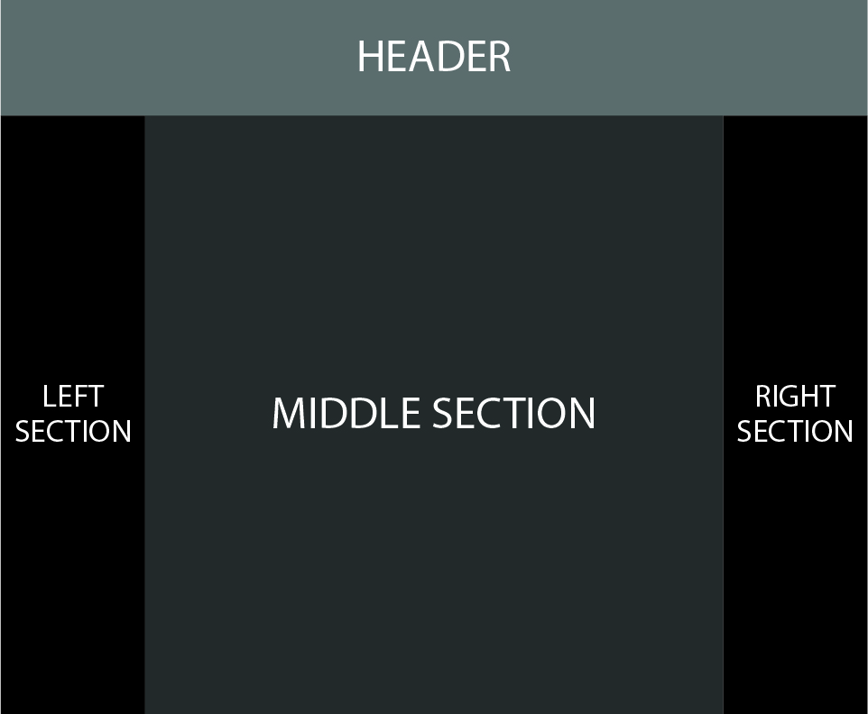

# New York Times Page
*Este proyecto es la maquetación de una página del diario New York Times usando html y css. *

Se establece la guía para mantener y escalar el proyecto.

## Estructura de carpetas
En la carpeta principal está el index.html y el index.css para facilitar la lectura por el navegador. Los demás archivos están almacenados en carpetas agrupado por su tipo y función.

**img**			*contiene las imágenes*
**fonts**		*contiene las fuentes*
index.html
index.css

## Layout
La pagina está conformada por cuatro secciones: header, left-section, middle-section y right-section, estructuradas en tres columnas.
- Header: ocupa el 100% del ancho disponible.
- Middle-section: se ubica en el centro. Contiene la información principal del diario.
- Left-section: se ubica a la izquierda, ocupa un 15% del acho disponible. Contiene un solo articulo. 
- Right-section: se ubica a la derecha, ocupa un 15% del acho disponible. No tiene contenido, sirve para darle simetría a la página.

*El layout está contenido en un main-container que tiene 10% de magin horizontal.*
Se estructura usando grid:
```css
.main-container {
  display: grid;
  grid-template-rows: repeat(2 1fr);
  grid-template-columns: 15% 1fr 15%;
  margin: 0 10%;
}
```


## Componentes
Los componentes se organizan basados en los articulos. Cada artículo tiene un contenedor que albega toda su información: títulos, subtitulos, descripciones, contenido e imágenes.
Se usa BEM para establecer las clases de los elementos. El bloque es el artículo o seccion y los elementos son descriptivos. 

**Para mejorar la accesibilidad todas las imágenes deben tener su descripción en el atributo alt**
```html
      <div class="up-section">
        <figure class="up-section__img">
          
        </figure>
        <h3 class="up-section__title">
          Global enforcement of anti-corruption laws like the Foreign Corrupt Practices
        </h3>
        <p class="up-section__description">
          Lorem ipsum dolor sit amet consectetur adipisicing elit. Optio harum sed cum quas minus voluptatibus, dolorum repellat ipsum aut earum perspiciatis tempora quisquam totam culpa molestiae at enim laudantium suscipit?
        </p>
      </div>

```

## Variables
Para tener mayor control sobre los colores, los tipos de fuente y el espaciado, se declaran estas propiedades como variables al comienzo del documento CSS dentro de :root
```css
:root {
  --main-font: newyorktimes;
  --black-color: black;
  --border: 2px solid var(--black-color);
  --single-space: 10px;
  --doble-space: 20px;
  --h1: 5em;
  --h2: 1.5em;
  --h3: 1.2em;
  --h4: .8em;
  --p: 1em;
}
```
Para llamar las variables se debe asignar a la propiedad el valor:
`var(--main-font)`

**Todos las propiedades referenciadas deben llamarse por variables.**

## Guía de estilo del código

#### HTML
Se usan etiquetas sintácticas para nombrar los elementos principales: header, main, aside.
Se cuida la indentación y el orden de los elementos siguiendo el flujo de la página.

#### CSS
Las clases se llaman usando la metodología BEM.
`bloque__elemento--modificador`
Las declaraciones se estructuran en el siguiente orden:
- Propiedades del modelo de caja
- Posicionameniento
- Tipografía
- Decoración

```css
.example-element {
 display: block;
 width: 220px;
 height: 40px;
 position: relative;
  font-family: var(--main-font);
 text-transform: uppercase;
 background-color: #333333;
}
```